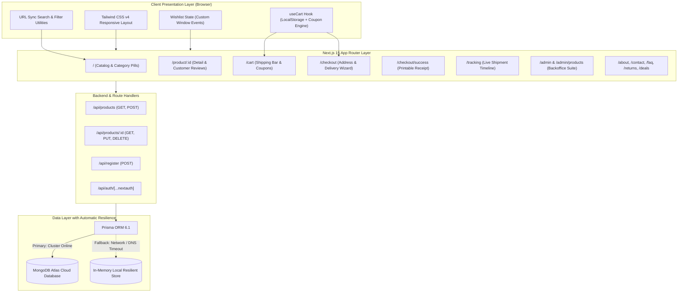

# 🛍️ Tatli.com — Modern Full-Stack E-Commerce Platform

<div align="center">

[](https://nextjs.org/)
[](https://react.dev/)
[](https://www.typescriptlang.org/)
[](https://tailwindcss.com/)
[](https://www.prisma.io/)
[](https://www.mongodb.com/)
[](https://vitest.dev/)
[](https://next-auth.js.org/)
[](https://github.com/haticetatli/next.js-ecommerce/actions)

<p align="center">
  <strong>A high-performance, enterprise-grade, full-stack e-commerce application engineered with Next.js 15 App Router, React 19, TypeScript, and Tailwind CSS v4.</strong>
</p>

<p align="center">
  <a href="#-key-features">Key Features</a> •
  <a href="#-architecture--resilience">Architecture</a> •
  <a href="#-tech-stack">Tech Stack</a> •
  <a href="#-automated-testing">Unit Tests</a> •
  <a href="#-getting-started">Getting Started</a> •
  <a href="#-developer--author">Author</a>
</p>

</div>

---

## 📖 Overview

**Tatli.com** is a comprehensive, production-ready e-commerce platform designed and developed by **Hatice Tatlı**. Built from the ground up with **clean architecture**, **strict TypeScript**, **offline-resilient data fallbacks**, and **modern UI/UX principles**, it showcases enterprise full-stack development skills suitable for mission-critical web applications.

The platform features a **30-item curated multi-category catalog**, a **real-time URL-synchronized discovery engine**, a **tiered shipping progress calculator**, an **interactive coupon discount system**, a **complete multi-step checkout with printable receipts**, an **admin backoffice with live inventory management**, and an **interactive order tracking timeline**.

---

## 🌟 Key Features

### 🛍️ 1. Multi-Category Product Discovery (30 Curated Items)
- **6 Diverse Categories:** Phones, Laptops, Smartwatches, Audio Accessories, Running Shoes, and Backpacks (5 high-resolution items per category).
- **URL-Synchronized Filter State:** Real-time query parameters binding (`?category=...&search=...`) allowing sharable and bookmarkable search results.
- **Multi-Criteria Sorting:** Sort dynamically by Price (Low to High / High to Low), Customer Rating, Name (A-Z), or Featured.
- **Stock Status Filter:** Instant toggle for "In Stock Only" with zero-delay client filtering.
- **Resilient Image Handling:** Universal image adapter supporting external HTTPS CDNs, relative assets, and Base64 fallbacks without layout shifts.

### 🧺 2. Advanced Cart & Coupon Discount Engine
- **Free Shipping Motivation Bar:** Live progress indicator towards the 500 ₺ free shipping threshold.
- **Interactive Promo Codes:**
  - `TATLI10`: 10% discount across the entire cart.
  - `TATLI20`: 20% discount on orders exceeding 1.000 ₺.
  - `KARGO`: 100% discount on shipping fees (49,90 ₺ savings).
- **Hydration-Safe Storage:** Custom `useCart` hook with `isMounted` guards preventing SSR hydration mismatches and guaranteeing `localStorage` persistence.

### 💳 3. End-to-End Multi-Step Checkout
- **Delivery Address Validation:** Full client-side validation for recipient name, phone, city, district, and street address.
- **Shipping Method Selection:** Choice between Standard Ground Shipping and Express 24h Courier (+49,90 ₺).
- **Payment Simulation:** Realistic 3D Secure credit card form with test feedback.
- **Printable Order Receipt (`/checkout/success`):** Auto-generated alphanumeric order tracking code (e.g., `#ORD-829143-TR`), estimated delivery dates, line-item cost breakdown, and one-click browser printing.

### 🛠️ 4. Admin Backoffice Suite (`/admin`)
- **Executive KPI Dashboard:** Real-time summary metric cards for Total Revenue, Total Orders, Active Catalog Items, and Registered Users.
- **Inventory Control Table (`/admin/products`):** Instant search, pagination, in-place editing modal, stock status toggle switch, and delete confirmations.
- **Product Creation Wizard (`/admin/products/new`):** Clean form with live image preview and category assignments.

### 📦 5. Real-Time Order Tracking (`/tracking`)
- **Interactive Timeline:** Enter any order code or click fast-test chips (`#ORD-829143-TR`) to see a visual logistics timeline (*Order Placed ➔ Packing ➔ Handed to Carrier ➔ Out for Delivery ➔ Delivered*).

### ❤️ 6. Persistent Wishlist (`/favorites`)
- **Heart Toggle Animation:** Quick save from any product card.
- **Cross-Tab Synchronization:** Custom window event dispatcher syncing the live navbar wishlist badge in real time.
- **Direct Add to Basket:** Move items straight from the wishlist into the active shopping cart.

### 🏢 7. Complete Support & Corporate Suite
- **About Us (`/about`):** Company vision, mission, and key metrics.
- **Contact & Live Support (`/contact`):** Validated contact form with toast feedback, headquarters location, and WhatsApp hotline.
- **Easy 14-Day Returns (`/returns`):** Step-by-step return guide and shipping code information.
- **Help Center & FAQ (`/faq`):** Searchable accordion FAQ covering orders, shipping, and warranty.
- **Legal Compliance (`/privacy`, `/terms`):** GDPR / KVKK-compliant privacy policy and terms of service.

---

## 📐 Architecture & Resilience



> **🛡️ Zero-Downtime Fallback Architecture:** If MongoDB Atlas is sleeping or network DNS resolution fails, the platform automatically intercepts the timeout and serves data from a high-fidelity local in-memory store. Visitors and recruiters will **never encounter a 500 error or broken UI**.

---

## 🛠️ Tech Stack

| Category | Technology | Purpose |
|---|---|---|
| **Framework** | **Next.js 15.4** (App Router) | Server & Client Components, Dynamic Route Handlers, Streaming SSR |
| **Frontend UI** | **React 19.0** | Modern component lifecycle, transitions, hooks |
| **Language** | **TypeScript 5.0** | 100% strict type safety, zero `any` declarations |
| **Styling** | **Tailwind CSS v4** | Next-generation utility-first styling with zero runtime overhead |
| **Database & ORM**| **MongoDB Atlas + Prisma 6.1**| Cloud NoSQL database with type-safe schema definitions |
| **Authentication** | **NextAuth.js 4 + Bcrypt** | Secure JWT sessions, Google OAuth, and credential authentication |
| **Unit Testing** | **Vitest 5.0** | High-speed automated unit testing for business logic |
| **Icons & UI Kits**| **React Icons & Material UI** | Rating stars and iconography |
| **Notifications** | **React Hot Toast** | Lightweight dynamic toast alerts |
| **CI / CD** | **GitHub Actions** | Automated build, test, and lint validation on every push |

---

## 🧪 Automated Testing

The project maintains comprehensive unit tests powered by **Vitest**:

```bash
# Run tests once:
npm run test

# Run tests in interactive watch mode:
npm run test:watch
```

### Test Coverage Highlights:
- **`tests/cartUtils.test.ts` (8 Tests):**
  - Cart subtotal calculations with quantity multipliers.
  - 500 ₺ free shipping qualification threshold.
  - Percentage coupons (`TATLI10`, `TATLI20`) and fixed shipping coupons (`KARGO`).
  - Turkish Lira (`₺`) currency formatting with thousand-separators.
- **`tests/filterUtils.test.ts` (5 Tests):**
  - Case-insensitive, bilingual category matching (`Telefon` / `Phone`, `Çanta` / `Bag`).
  - Search term matching across titles, brands, and descriptions.
  - Stock availability filters.
  - Ascending and descending price sorting algorithms.

---

## 📂 Directory Structure

```text
├── .github/
│   └── workflows/
│       └── ci.yml               # Automated CI pipeline (build & test)
├── app/
│   ├── about/                   # About us corporate story & metrics
│   ├── admin/                   # Admin dashboard KPI metrics
│   │   └── products/            # Product table, edit modal & creation wizard
│   ├── api/                     # REST Route Handlers (products, auth, register)
│   ├── cart/                    # Shopping cart with coupon engine
│   ├── checkout/                # Multi-step checkout & /success order receipt
│   ├── contact/                 # Contact form & customer support channels
│   ├── deals/                   # Active campaigns & coupon copy cards
│   ├── faq/                     # Searchable FAQ accordion
│   ├── favorites/               # Wishlist management page
│   ├── login/ & register/       # NextAuth authentication pages
│   ├── privacy/ & terms/        # Legal KVKK / GDPR compliance documents
│   ├── product/[productId]/     # Dynamic product detail & review tabs
│   ├── profile/                 # User profile & past order history
│   ├── returns/                 # 14-day easy return policy guide
│   ├── tracking/                # Interactive shipment tracking timeline
│   ├── components/              # Modular UI components (Navbar, Cards, Modals)
│   ├── layout.tsx               # Root Layout with Suspense boundaries & Toaster
│   └── page.tsx                 # Main showcase page
├── hooks/
│   └── useCart.tsx              # Cart, coupon, and shipping state management
├── prisma/
│   └── schema.prisma            # MongoDB database models (User, Product, Review)
├── tests/                       # Automated Vitest test suites
├── types/                       # Universal TypeScript domain interfaces
├── utils/
│   ├── cartUtils.ts             # Pure financial calculation utilities
│   ├── filterUtils.ts           # Pure filtering and sorting utilities
│   └── Products.tsx             # 30-item curated fallback catalog
└── package.json
```

---

## 💻 Getting Started

### 1. Clone the Repository
```bash
git clone https://github.com/haticetatli/next.js-ecommerce.git
cd next.js-ecommerce
```

### 2. Install Dependencies
```bash
npm install
```

### 3. Configure Environment Variables
Copy the `.env.example` file:
```bash
cp .env.example .env
```
Fill in your own credentials:
```env
DATABASE_URL="mongodb+srv://<username>:<password>@cluster0.mongodb.net/shop?retryWrites=true&w=majority"
NEXTAUTH_SECRET="your_nextauth_secret_key"
GOOGLE_CLIENT_ID="your_google_oauth_client_id"
GOOGLE_CLIENT_SECRET="your_google_oauth_client_secret"
```
*(Note: If no database URL is provided, the application automatically runs using the resilient local fallback).*

### 4. Generate Prisma Client
```bash
npx prisma generate
```

### 5. Run Local Development Server
```bash
npm run dev
```
Open [http://localhost:3000](http://localhost:3000) in your browser.

### 6. Production Build & Start
```bash
npm run build
npm run start
```

---

## 🎟️ Active Demo Coupons

| Coupon Code | Discount Value | Requirement |
|---|---|---|
| **`TATLI10`** | **10% OFF** | Applies to entire cart |
| **`TATLI20`** | **20% OFF** | Minimum cart value of 1.000 ₺ |
| **`KARGO`** | **FREE SHIPPING** | Eliminates 49,90 ₺ shipping fee |

---

## 👩‍💻 Developer & Author

<div align="center">

### **Hatice Tatlı**
**Computer Engineer & Full-Stack Software Developer**

[](https://github.com/haticetatli)
[](mailto:20227170018@ogr.oku.edu.tr)

*Graduated with a Bachelor's Degree in Computer Engineering. Passionate about building modern, scalable, and resilient web architectures with clean TypeScript and React/Next.js ecosystem.*

</div>

---

## 📄 License

This project is licensed under the [MIT License](LICENSE).
