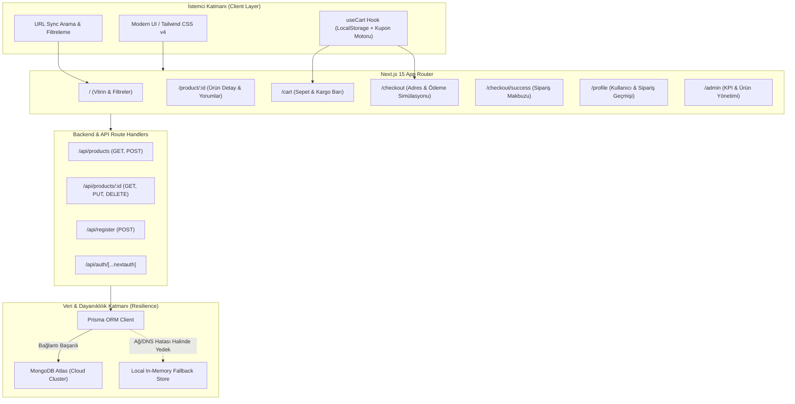

# 🛍️ Tatli.com — Modern Full-Stack E-Commerce Platform

[](https://nextjs.org/)
[](https://react.dev/)
[](https://www.typescriptlang.org/)
[](https://tailwindcss.com/)
[](https://www.prisma.io/)
[](https://www.mongodb.com/)
[](https://vitest.dev/)
[](https://next-auth.js.org/)
[](https://github.com/)

**Tatli.com**, modern web standartlarına uygun olarak **Next.js 15 (App Router)**, **React 19**, **TypeScript** ve **Tailwind CSS v4** ile geliştirilmiş kapsamlı bir tam yığın (Full-Stack) e-ticaret platformudur. Staj çalışması olarak başlatılmış, modüler mimari, tip güvenliği, test otomasyonu, esnek veri katmanı ve modern UI/UX prensipleriyle baştan sona profesyonel bir portfolyo projesine dönüştürülmüştür.

---

## 🌟 Öne Çıkan Yetenekler (Key Highlights)

- ⚡ **Next.js 15 & React 19 Mimarisi:** Server & Client Components ayrımı, dinamik route parametreleri ve Suspense sınırlarıyla optimize edilmiş SSR/SSG.
- 🛡️ **Esnek & Kesintisiz Veri Katmanı:** Prisma ORM ile MongoDB Atlas entegrasyonu; veri tabanı bağlantısı olmadığında otomatik olarak devreye giren bellek içi (in-memory) yedekleme mekanizması.
- 🎯 **Akıllı Ürün Keşfi & URL Senkronizasyonu:** URL parametreleriyle senkronize anlık kategori filtreleme, başlık/açıklama araması, çok kriterli sıralama (Fiyat, Puan, İsim) ve stok filtresi.
- 🧺 **Gelişmiş Sepet & Kupon Motoru:** Dinamik ara toplam, 500 ₺ üzeri ücretsiz kargo ilerleme çubuğu, indirim kuponları sistemi (`TATLI10`, `TATLI20`, `KARGO`) ve `localStorage` kalıcılığı.
- 💳 **Uçtan Uca Demo Sipariş Akışı:** Kapsamlı teslimat adresi formu doğrulama, standart/hızlı kargo seçimi, sipariş özeti ve yazdırılabilir sipariş onay makbuzu (`/checkout/success`).
- 🛠️ **Yönetici Paneli (Admin Backoffice):** KPI göstergeleri, envanter tablosu, ürün ekleme/düzenleme/silme ve anlık stok durumu değiştirme (`/admin/products`).
- 🧪 **Otomatik Testler (Vitest):** Sepet hesaplamaları, kupon indirimleri ve filtreleme algoritmaları için birim test paketi (13/13 test başarılı).
- 📱 **Tamamen Duyarlı (Responsive) Tasarım:** Mobil cihazlardan geniş ekranlara kadar kusursuz çalışan, slayt mobil çekmece (Hamburger Menu) ve dokunmatik dostu kontroller.

---

## 📐 Mimari Şema (System Architecture)



---

## 🚀 Sayfalar ve Özellikler Detayı

### 1. Vitrin & Ürün Keşfi (`/`)
- **Promosyon Banner'ı:** Gradient zeminli, dikkat çekici vitrin alanı.
- **Güven Rozetleri (Benefits):** Ücretsiz kargo, 14 gün iade, 256-bit SSL güvenlik taahhütleri.
- **Dinamik Kategori Şeridi:** Telefon, Laptop, Saat, Aksesuar, Ayakkabı, Çanta hızlı filtreleri.
- **Sıralama & Filtreleme:**
  - Öne çıkanlar, En düşük/en yüksek fiyat, En çok değerlendirilen, İsim (A-Z).
  - "Yalnızca Stoktakiler" onay kutusu ve aktif filtreleri tek tıkla sıfırlama.
- **Favori (Wishlist) Desteği:** Ürün kartlarında yer alan kalp butonu ile favorilere ekleme ve çıkarma.

### 2. Ürün Detay Sayfası (`/product/[productId]`)
- Ürün görselleri için optimize edilmiş resim görüntüleyici.
- Dinamik stok durumu göstergesi (Stokta Var / Tükendi).
- Adet seçici (Counter) ve doğrudan sepete ekleme butonu.
- Sekmeli bilgi alanı: Detaylı Açıklama, Teknik Özellikler, Kullanıcı Yorumları.
- Kullanıcı yorumu ekleme formu (1-5 yıldız seçici ve metin alanı).
- Aynı kategoriden "İlginizi Çekebilecek Diğer Ürünler" öneri modülü.

### 3. Alışveriş Sepeti (`/cart`)
- Ürün silme, adet artırma/azaltma ve sepeti tamamen temizleme.
- **500 ₺ Üzeri Ücretsiz Kargo İlerleme Çubuğu:** Kalan tutarı anlık hesaplayan motivasyon barı.
- **Kupon Kodu Sistemi:**
  - `TATLI10`: Tüm sepete %10 indirim uygular.
  - `TATLI20`: Tüm sepete %20 indirim uygular.
  - `KARGO`: Kargo ücretini sıfırlar.
- Tutar döküm kartı (Ara Toplam, Kargo Bedeli, İndirim Miktarı, Genel Toplam).

### 4. Çok Adımlı Ödeme & Sipariş (`/checkout`)
- İsim, telefon, şehir, ilçe ve tam adres doğrulama formu.
- Kargo seçeneği: Standart Kargo veya Hızlı Kargo (+49,90 ₺).
- Demo ödeme bilgilendirme kutusu (CVV ve kart no simülasyonu).
- Siparişi tamamlama ve otomatik sipariş kaydı oluşturma.

### 5. Sipariş Onay Ekranı (`/checkout/success`)
- Sipariş referans kodu (Örn: `#ORD-948123-TR`).
- Tahmini teslimat tarihi göstergesi.
- Sipariş edilen ürünlerin dökümü ve fatura özeti.
- Tarayıcı üzerinden makbuz yazdırma ("Makbuzu Yazdır") aksiyonu.

### 6. Kullanıcı Profili & Sipariş Geçmişi (`/profile`)
- Kullanıcı adı, e-posta ve hesap durumu rozeti.
- Geçmiş siparişler listesi, kargo durumu adımları ve toplam sipariş tutarı.

### 7. Yönetici Paneli (`/admin`)
- **Dashboard (`/admin`):** Toplam Ciro, Sipariş Sayısı, Aktif Ürün ve Kayıtlı Kullanıcı KPI kartları.
- **Ürün Yönetimi (`/admin/products`):**
  - Tüm ürünlerin listelendiği filtreli ve aramalı veri tablosu.
  - Anlık stok durumu değiştirme anahtarı.
  - Ürün düzenleme (In-place modal).
  - Güvenli ürün silme aksiyonu.
- **Yeni Ürün Ekleme (`/admin/products/new`):**
  - Ürün adı, kategori, marka, fiyat, stok durumu ve açıklama formu.
  - Canlı görsel önizleme desteği.

---

## 🛠️ Teknoloji Yığını (Tech Stack)

| Kategori | Teknoloji | Amaç |
|---|---|---|
| **Çekirdek Çerçeve** | Next.js 15.4 (App Router) | Hibrit SSR/SSG, modern sayfa yönlendirme, Route Handlers |
| **Kullanıcı Arayüzü** | React 19 | Modern bileşen yaşam döngüsü ve optimizasyonlar |
| **Programlama Dili** | TypeScript 5 | Katı tip denetimi ve uçtan uca tip güvenliği |
| **Stil & Tasarım** | Tailwind CSS v4 | Hızlı, modern ve duyarlı (responsive) utility-first tasarım |
| **Bileşen Kütüphaneleri** | Material UI (`@mui/material`), React Icons | Yıldız puanlama ve zengin ikon seti |
| **Veritabanı & ORM** | Prisma 6.1 + MongoDB Atlas | NoSQL bulut veri tabanı modellemesi ve sorguları |
| **Kimlik Doğrulama** | NextAuth.js 4 + Bcrypt | Güvenli JWT oturum yönetimi ve parola hashleme |
| **Birim Testleri** | Vitest 5.0 | İş mantığı ve yardımcı fonksiyonlar için hızlı birim testleri |
| **Bildirimler** | React Hot Toast | Kullanıcı dostu dinamik toast bildirimleri |

---

## 🧪 Birim Testleri (Unit Tests)

Projede sepet hesaplamaları ve ürün filtreleme algoritmaları **Vitest** ile test edilmektedir:

```bash
# Testleri tek seferlik çalıştırmak için:
npm run test

# İzleme (watch) modunda çalıştırmak için:
npm run test:watch
```

**Mevcut Test Dosyaları:**
- `tests/cartUtils.test.ts`: Sepet ara toplamı, 500 ₺ kargo kuralı, yüzde/kargo kupon indirimleri ve para birimi biçimlendirme testleri (8 test).
- `tests/filterUtils.test.ts`: Kategoriye göre filtreleme, arama sorgusu, yalnızca stokta olanlar ve fiyata göre sıralama testleri (5 test).

---

## 💻 Kurulum ve Çalıştırma (Getting Started)

### 1. Depoyu Klonlayın
```bash
git clone https://github.com/haticetatli/<repo-adi>.git
cd <repo-adi>
```

### 2. Bağımlılıkları Yükleyin
```bash
npm install
```

### 3. Ortam Değişkenlerini Tanımlayın
Kök dizinde `.env.example` dosyasını kopyalayarak `.env` dosyanızı oluşturun:
```bash
cp .env.example .env
```

`.env` dosyasını açıp bilgilerinizi girin:
```env
DATABASE_URL="mongodb+srv://<kullanici>:<sifre>@cluster0.mongodb.net/shop?retryWrites=true&w=majority"
NEXTAUTH_SECRET="super_secret_nextauth_key"
GOOGLE_CLIENT_ID="google_client_id_buraya"
GOOGLE_CLIENT_SECRET="google_client_secret_buraya"
```
*(Not: MongoDB bağlantınız olmasa bile uygulama otomatik yerel bellek yedeğiyle kesintisiz çalışır).*

### 4. Prisma İstemcisini Derleyin
```bash
npx prisma generate
```

### 5. Geliştirme Sunucusunu Başlatın
```bash
npm run dev
```
Uygulama varsayılan olarak `http://localhost:3000` (veya boş olan port) üzerinde çalışacaktır.

### 6. Üretim (Production) Derlemesi
```bash
npm run build
npm run start
```

---

## 🎟️ Demo Kupon Kodları

Sepet sayfasında aşağıdaki kuponları test edebilirsiniz:
- `TATLI10` — %10 indirim
- `TATLI20` — %20 indirim
- `KARGO` — Ücretsiz Kargo (49,90 ₺ tasarruf)

---

## 📂 Proje Dizin Yapısı

```text
├── .github/
│   └── workflows/
│       └── ci.yml               # GitHub Actions otomatik CI pipeline'ı
├── app/
│   ├── actions/                 # Sunucu eylemleri (getCurrentUser vb.)
│   ├── admin/                   # Admin paneli (Dashboard, ürün yönetimi, yeni ürün)
│   ├── api/                     # Route Handlers (/api/products, /api/register)
│   ├── cart/                    # Sepet sayfası
│   ├── checkout/                # Çok adımlı checkout ve /success onay sayfası
│   ├── components/              # Yeniden kullanılabilir React bileşenleri
│   │   ├── admin/               # Admin yan menüsü (Sidebar)
│   │   ├── auth/                # Giriş ve kayıt formları
│   │   ├── cart/                # Sepet detay tablosu ve kupon girişi
│   │   ├── detail/              # Ürün detay, galeri ve yorum bileşenleri
│   │   ├── general/             # Buton, input, avatar vb. atomik UI
│   │   ├── home/                # Banner, kategoriler, vitrin ürünleri
│   │   └── navbar/              # Header, arama barı, sepet sayacı, kullanıcı menüsü
│   ├── product/[productId]/     # Dinamik ürün detay sayfası
│   ├── profile/                 # Kullanıcı profil ve sipariş geçmişi
│   ├── layout.tsx               # Root Layout (Navbar, Footer, Toaster, CartProvider)
│   └── page.tsx                 # Ana sayfa
├── hooks/
│   └── useCart.tsx              # Kupon ve sepet hesaplama state yönetimi
├── prisma/
│   └── schema.prisma            # MongoDB veri modelleri
├── tests/
│   ├── cartUtils.test.ts        # Sepet iş mantığı birim testleri
│   └── filterUtils.test.ts      # Filtreleme ve sıralama testleri
├── types/
│   └── index.ts                 # Tüm TypeScript domain arayüzleri ve tipleri
├── utils/
│   ├── cartUtils.ts             # Finansal ve sepet hesaplama yardımcıları
│   ├── filterUtils.ts           # Arama, filtreleme ve sıralama yardımcıları
│   └── Products.tsx             # Zengin mock ürün veri tabanı
└── README.md
```

---

## 👩‍💻 Geliştirici

**Hatice Tatlı**  
* 🎓 Bilgisayar Mühendisliği Mezunu (Computer Engineering)  
* 💼 Full-Stack & Frontend Geliştirici  
* 🌐 GitHub: [@haticetatli](https://github.com/haticetatli)  
